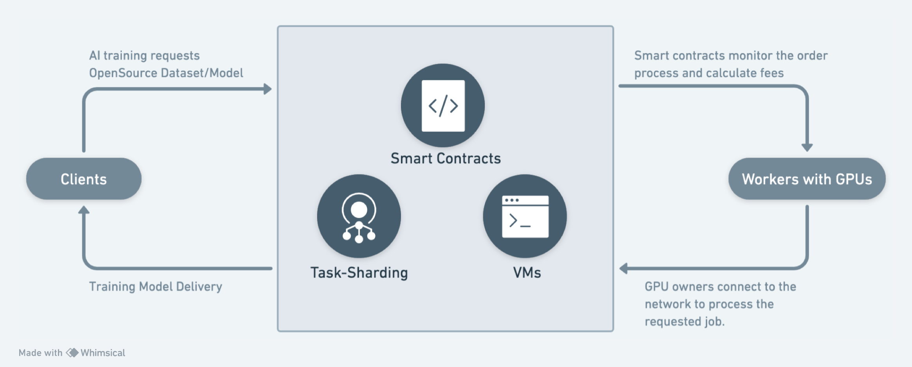
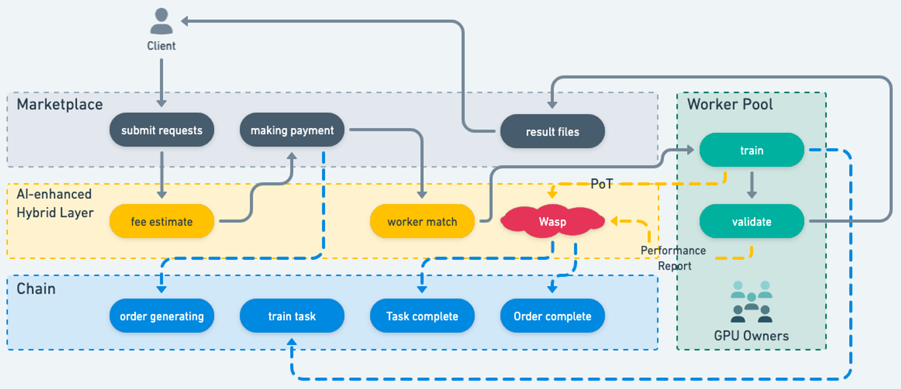
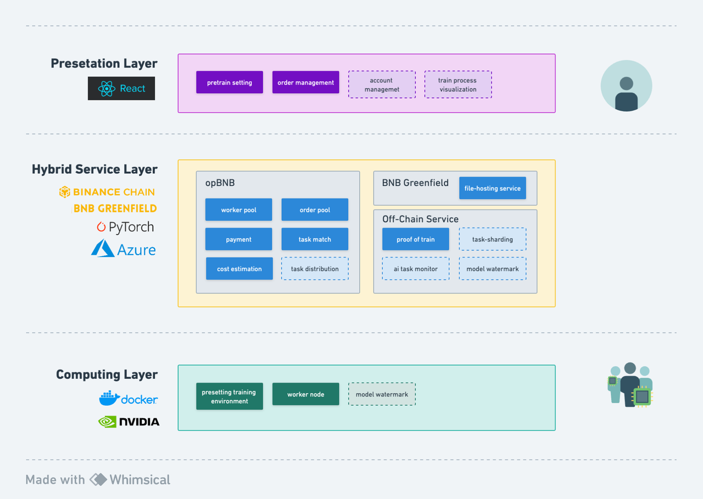
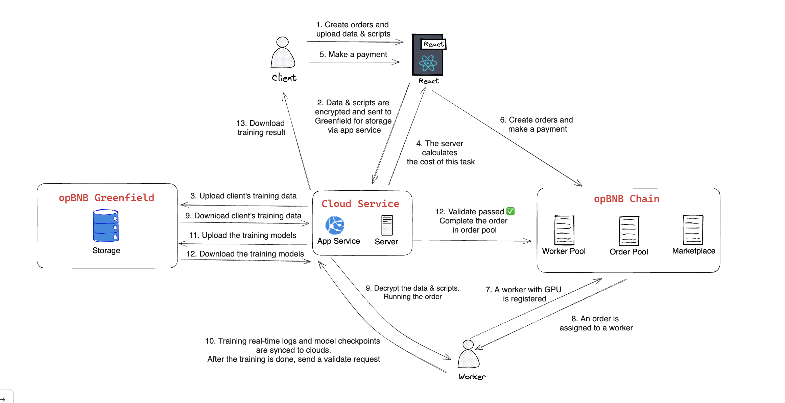
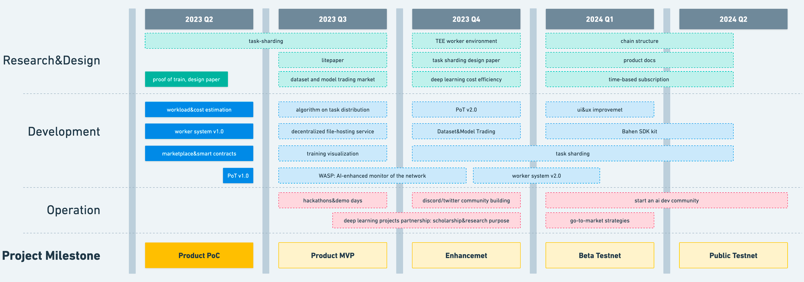

## Hi there 👋

Bahen Network is a decentralized AI training platform with distributed machine learning protocols. We have two key products:

1. Marketplace
    
    Bahen Network provides easy-to-use low-code solutions for non-experts to build advanced AI models, making sophisticated AI development accessible to regular users. The intuitive drag-and-drop interface abstracts away unnecessary programming complications.
    
    For professional developers, we offer flexible SDKs to connect with distributed machine learning protocols, enabling seamless integration and programmatic orchestration of decentralized training pipelines.
    
2. Distributed ML protocols
    
    On the provider side, GPU contributors can collectively harness heterogeneous computational resources across edges and data centers through our scalable protocols. By transparently coordinating workloads across geo-distributed workers, models can be collaboratively trained in a privacy-preserving manner.
    
    Our **proof-of-train** mechanism incentivizes verifiable measures of the training process to establish trust and prevent fake contributions. The aggregated proofs are validated before reward allocation. This enables result reproducibility while protecting sensitive information.
    

## **Participants**

---

There are four key roles in our network:

1. **Client**
   - The clients are users with needs to submit deep learning data and models, pay for the job, and have their training tasks securely executed under the protocol's protection.
2. **Worker (GPU Owners)**
   - The workers execute actual deep learning computation tasks with their GPU machines connected to the Worker Pool, performing model training and generating Proof of Train (PoT) to submit to Wasp.
   - When joining the Worker Pool, workers need to deposit a stake proportional to their computing power, ensuring no malicious behavior during task execution.
3. **Validator (GPU Owners)**
   - The validators verify the models produced by workers and generate corresponding Performance Reports, which are finally submitted to Wasp for processing.
   - When joining the Worker Pool, validators also need to deposit a stake proportional to their compute power to prevent any malicious acts during validation.
4. **Wasp (AI-Enhanced)**
   - Wasp is responsible for checking the PoT from workers and Performance Reports from validators, recording task results on-chain.
   - The design rationale of Wasp is to learn about legitimate deep learning processes and result verification, gradually enhancing protection within the protocol.

## How it Works?

---

## Architecture

---

## Flowchart

---

## Feature Designs

---

### Implementation of *Proof of Train*

During the hackathon phase, we have implemented two parts of the Proof of Train:

1. By monitoring real-time training data (including training loss, GPU metrics, etc.), we can prove whether the worker is training according to the client's specifications.
2. By randomly selecting a certain number of training data for each saved model parameter and calculating the training loss of the sample data, we can compare it with step 1 to verify the effectiveness of the training.

Read more:
[proof_of_training](https://github.com/Bahen-Network/Bahen-Client/blob/57af7e8815a2a9162b888d679bce33066f8dd6c4/docs/proof_of_training.pdf)

### Implementation of ***Privacy and Safety Modules***

In our project, we have adopted a strategy where clients outsource their training tasks to workers with GPUs. While this approach utilizes computing power and speeds up data processing, it also introduces a new challenge - protecting the privacy of training data and scripts. This article provides a detailed overview of our privacy and security module design, offering comprehensive measures to address these challenges.

Read more:
[proof_of_training](https://github.com/Bahen-Network/Bahen-Client/blob/57af7e8815a2a9162b888d679bce33066f8dd6c4/docs/safety_and_privacy.pdf)

### Reseach on *Task Sharding*

In our project, we are trying to iterate the relationship between order, task, and worker. We are attempting to split one order into multiple tasks to be completed by multiple workers in different locations for deep learning computation and synchronization, moving from a one-to-one relationship to a one-to-many relationship. We are currently in the research stage.

Read more:
[Task Sharding](https://github.com/Bahen-Network/Bahen-Client/blob/57af7e8815a2a9162b888d679bce33066f8dd6c4/docs/task_sharding.pdf)

## Future Development

---

### Long-Term Vision

Bahen.ai aim to promote diversified development in the field of artificial intelligence by breaking through computational bottlenecks and enhancing data collaboration, allowing everyone to explore the future of AI on an equal footing.

We believe that AGI (Artificial General Intelligence) is not a monopoly or oligopoly, but rather a combination of various types of AI from different fields. The decentralized nature of blockchain will be the cornerstone to achieve these connections.

### Road Map

## Team

---

| Name | Role | Brief  | Contact |
| --- | --- | --- | --- |
| Xiaohu | Product Owner | Web3 research analyst; Years of product management experience; Undergraduate in Mathematics and Statistics from the University of Toronto | telegram: https://t.me/amazingcarrot666 |
| Kejie | Chief AI Scientist | Microsoft software engineer; AI researcher in UIUC lab; Graduate student in MSCS at UIUC; Undergraduate in Engineering Science from University of Toronto |  |
| Xu | Fullstack Engineer | Microsoft software engineer; Used to intern @ByteDance; Silver medal in the ACM Asia-Pacific |  |
| Yongqi | Algorithm Engineer | AI software engineer; Used to intern @ByteDance; Silver medal in the ACM Asia-Pacific |  |
| Xianchao | Backend Engineer | Microsoft software engineer; Used to intern @Alibaba; Bronze medal in the ACM Asia-Pacific |  |
| Jessie | Business & Partnership Manager | Traditional industry research analyst; Used to work @KPMG; Graduate of the LSE; Undergraduate in finance and economics at the University of Toronto |  |
| Zijian | AI Advisor | CS Phd at University of Michigan, Ann Arbor. |  |
